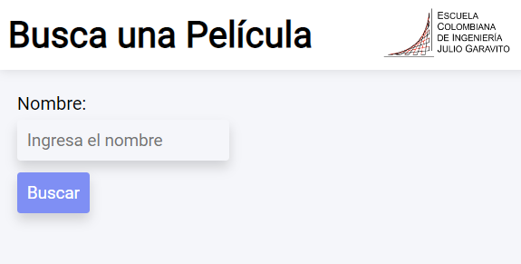
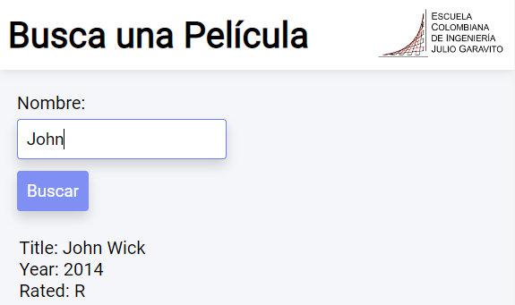

# Aplicaciones Distribuidas (HTTP, SOCKETS, HTML, JS,MAVEN, GIT)

Esta es una aplicación web que permite consultar la información de películas y series ingresadas por el usuario. Consta de un input text y un botón el cual hace la solicitud al servidor, de la película o serie ingresada, y este devuelve la información en formato JSON. El servidor consta de un caché tolerante a concurrencia y un servicio de conexión al API externo de [OMDb](https://omdbapi.com/) de donde obtendrá la información requerida.

## Getting Started

These instructions will get you a copy of the project up and running on your local machine for development and testing purposes.

### Prerequisites

What things you need to install the software and how to install them
Para hacer uso de la aplicación necesitarás tener instalado el siguiente software
- [JDK](https://www.oracle.com/co/java/technologies/javase/javase8-archive-downloads.html) version 1.8.x
- [Maven](https://maven.apache.org/download.cgi)
- [Git](https://git-scm.com/downloads)


### Installing

Para obtener una copia de la aplicación deberás clonar este repositorio. Ingresa la siguiente instrucción en Git Bash:

```
git clone https://github.com/Andresariz88/AREP-Taller01
```

Luego, ejecuta el siguiente comando para compilar y empaquetar todo el proyecto:

```
mvn package
```

Para iniciar el servidor web basta con ejecutar el main de la clase HttpServer o ingresar el siguiente comando en el terminal:
```
mvn exec:java
```

Para usarlo simplemente ingresa la siguiente URL en la barra de búsqueda de tu navegador web:
```
127.0.0.1:35000
```

Y listo, la aplicación estará lista para que la uses.




## Running the tests

Para correr los test automatizados usa el comando:
```
mvn test
```
También, la clase **JavaClient** establece una conexión con el servidor sin necesidad de usar un navegador web. Puedes probar el servicio enviando múltiples instrucciones por medio de la consola y ver cómo el servidor las maneja. El archivo [post-request.txt](./post_requests.txt) contiene varias líneas de peticiones que puedes copiar y pegar.

## Diseño
El proyecto cuenta con una clase llamada **HttpServer** la cual hace de fachada de servidor web y expone el servicio para ser consumido por un cliente. A su vez, esta clase cuenta con los mecanismos necesarios para manejar las diferentes solicitudes hechas por los clientes y un caché tolerante a concurrencia en el cual se guardarán todas las peticiones hechas al API externo, para que la próxima vez que se soliciten el tiempo y consumo de recursos sea mínimo.

Adicionalmente, se agregaron servicios **REST** que manejan las diferentes solicitudes para los recursos HTML, CSS, JavaScript y img de la página. Haciendo así que el servidor sea mucho más poderoso y permitiendo agregar nuevos servicios simplemente digitándolos en el main de la clase **WebApp**.

## Built With

* [Dropwizard](http://www.dropwizard.io/1.0.2/docs/) - The web framework used
* [Maven](https://maven.apache.org/) - Dependency Management
* [ROME](https://rometools.github.io/rome/) - Used to generate RSS Feeds

## Authors

* **Andrés Ariza** - *Initial work* - [Andresariz88](https://github.com/Andresariz88)


